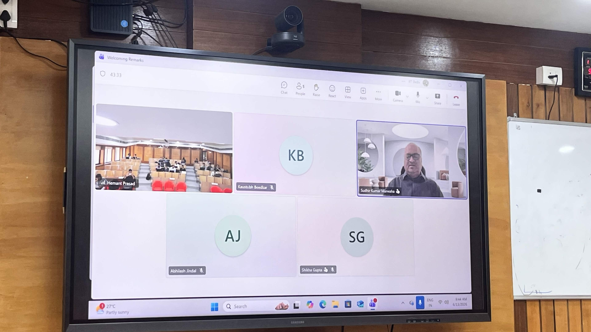
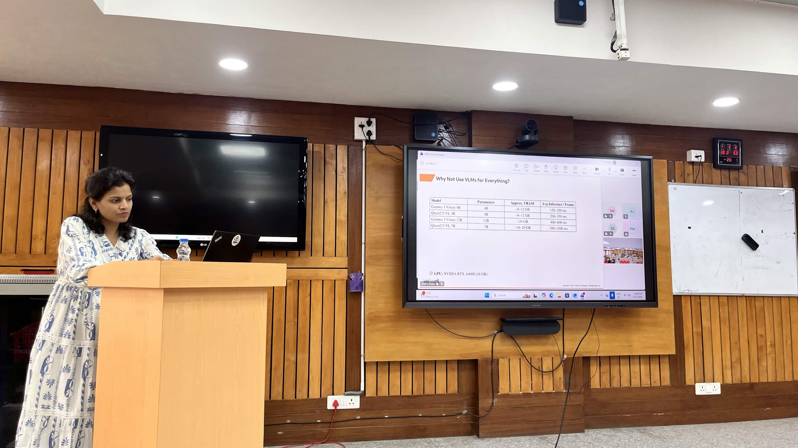
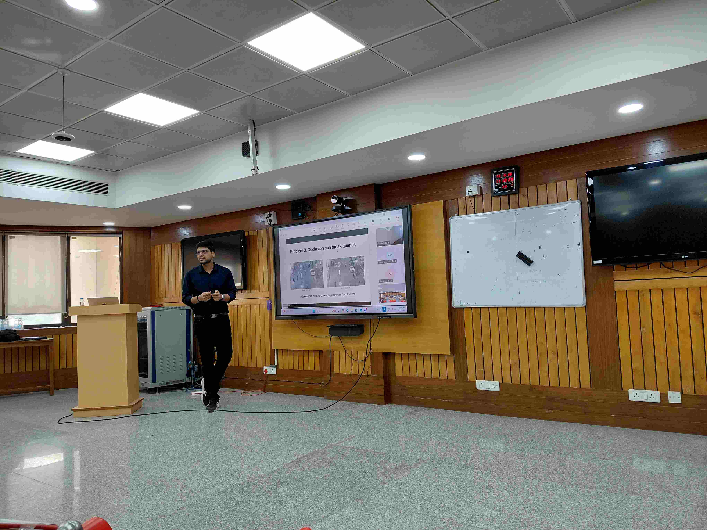
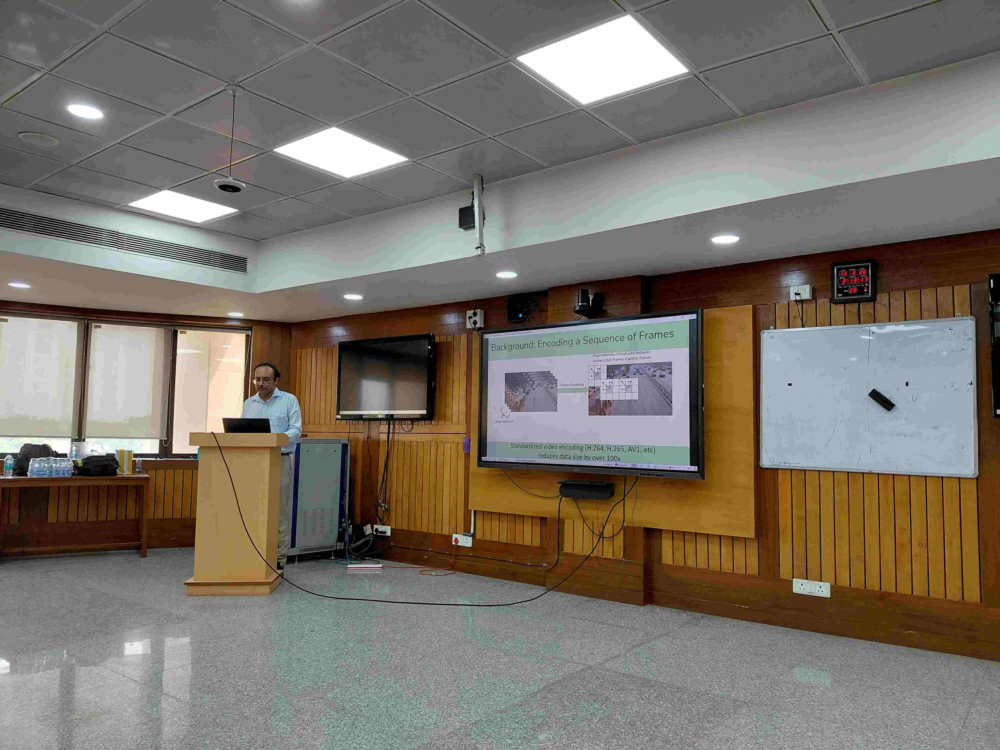
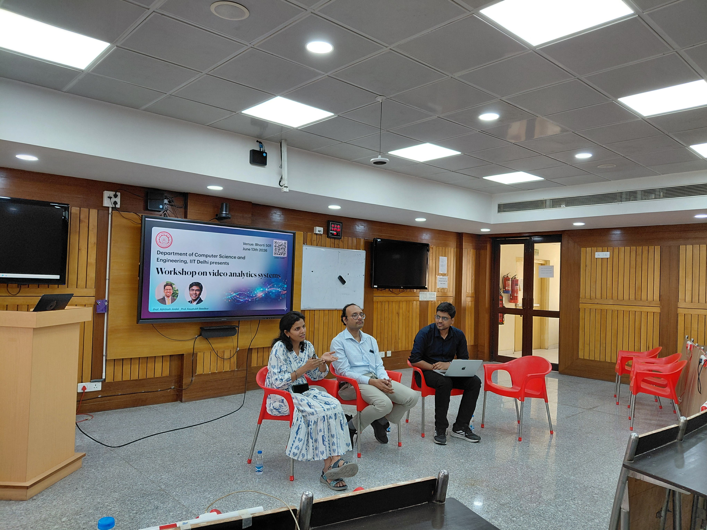
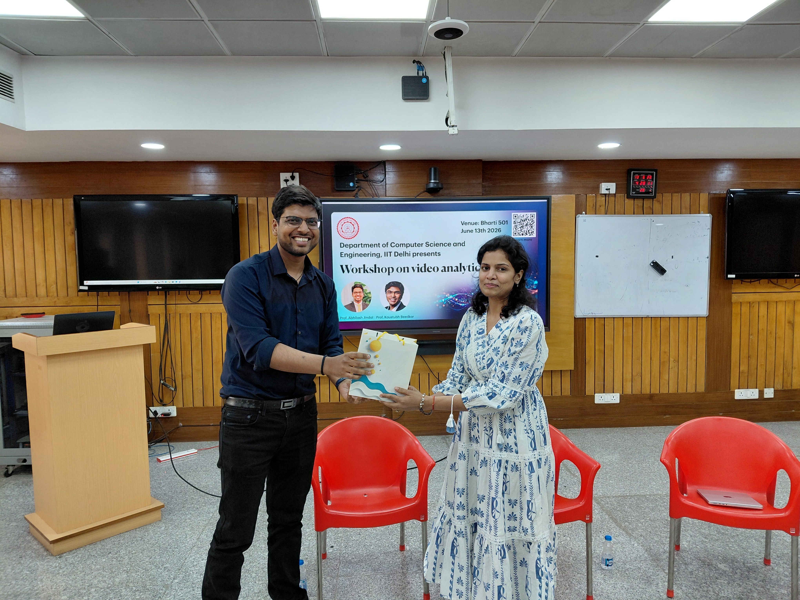
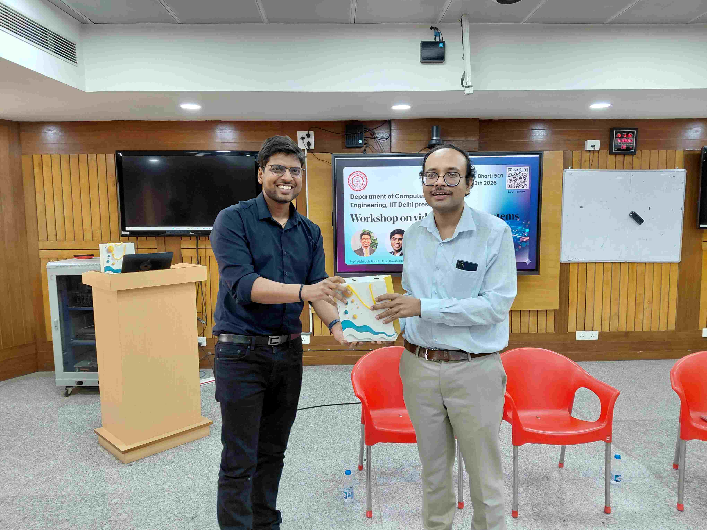
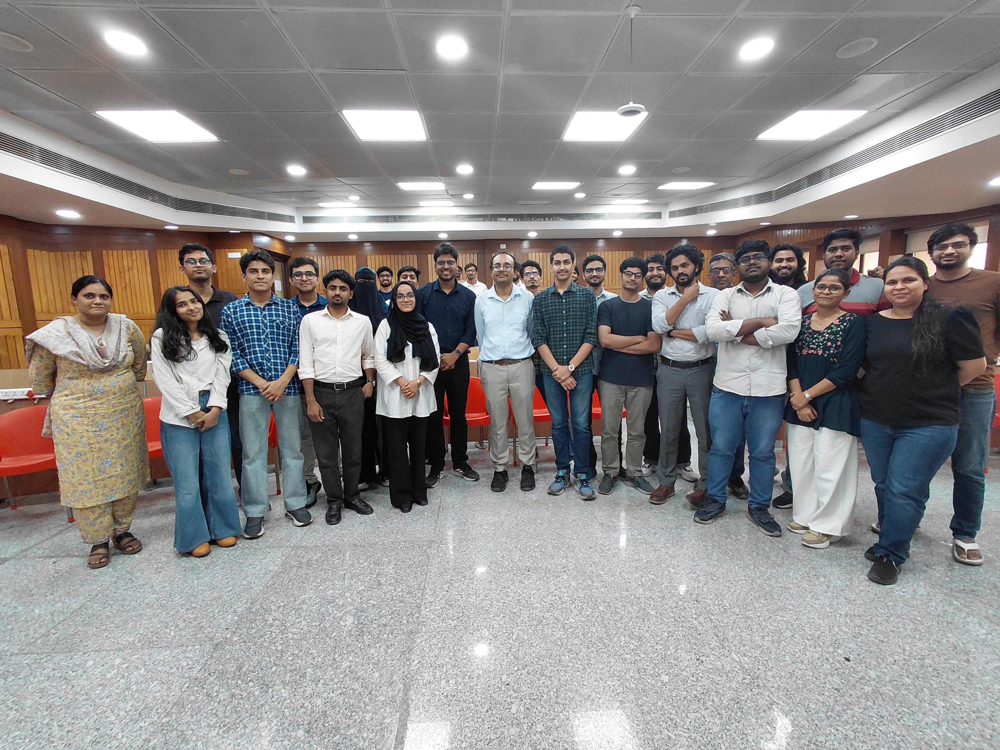
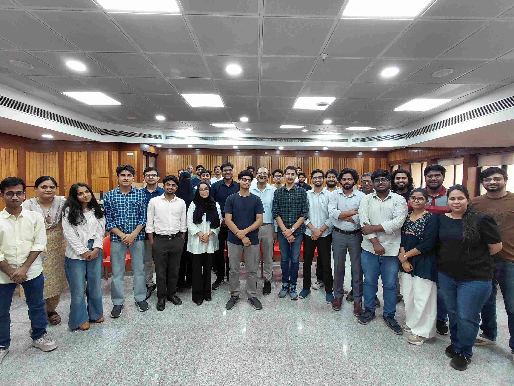

# Workshop on Video Analytics Systems

[Welcome](#about) | [Registration](#registration)  | [Logistics](#logistics) | [Schedule](#schedule) | [Speakers](#speakers) | [Photos](#photos)

## Welcome
The **Workshop on Video Analytics Systems**, organized by the [Department of Computer Science and
Engineering](https://www.cse.iitd.ac.in/) at IIT Delhi, will bring together students,
researchers, and industry practitioners working on video analytics, and will be held on June 13, 2026.

Video has become one of the dominant data types of our time, generated continuously by cameras in cities, 
vehicles, retail spaces, factories, and homes. Building the systems that can process, query, and analyze 
this video efficiently at scale is one of the more interesting open problems in systems research today. 
Questions of storage, query processing, GPU scheduling, edge-cloud trade-offs, latency, and cost sit at 
the heart of making video analytics actually work in practice.

Through a day of talks from leading researchers and industry experts, a hands-on session with our 
research prototype, and a panel discussion on open problems, participants will get a close look 
at where the field stands today and where it's headed.

## Registration 
Applications are open to third- and fourth-year undergraduate students, master’s students,
and industry professionals with an interest in systems, databases, computer vision, or ML infrastructure 
as well as anyone curious about how large-scale video systems are built. 
There are two application forms for the workshop, one for students and the other for industry professionals.

1. **Student application**  
   Interested students must submit their applications via the provided [online
   form](https://forms.gle/8m5xmv3UqLUCBDyXA) by ~~5:00 pm on May 31, 2026~~ **11:59 pm on June 6, 2026**. 
   Only candidates who complete this submission will be considered for
   the workshop.
   
2. **Industry professional application**
   Interested industry professional must submit their applications via the provided
   [online form](https://forms.gle/J44fUFnEaVYfying8) by ~~5:00 pm on May 31, 2026~~ **11:59 pm on June 6, 2026**.
   Only candidates who complete this submission will be considered for the workshop.
   
Selected candidates will receive notification of their acceptance into the
workshop by ~~June 6, 2026~~ **June 8, 2026**.

## Logistics
- **Venue**: Room 501, Bharti building, Department of Computer Science and Engineering, IIT Delhi.
- **Date**: June 13, 2026
- **After workshop**: Student participants who attend the workshop will receive a **Certificate of Participation**.
- **Clarification**: We won't be able to provide travel cost and accommodation, so please plan accordingly. Students are requested to bring their laptop for the hands-on demonstation.

## Schedule for the day 

|       Time          |              Event                 |
|:-------------------:|:-----------------------------------|
| 08:30 am – 09:15 am | Coffee                             |
| 09:15 am – 09:30 am | Welcoming remarks by SK Marwah     |
| 09:30 am – 10:30 am | Talk by Dr. Shikha Gupta           |
| 10:30 am – 11:30 am | Talk from IIT Delhi                |
| 11:30 am – 12:30 pm | Talk by Dr. Sibendu Paul           |
| 12:30 pm – 02:00 pm | Lunch                              |
| 02:00 pm – 03:00 pm | Talk by Prof. Arani Bhattacharya   |
| 03:00 pm – 03:30 pm | Hands-on session with TrQS         |
| 03:30 pm – 04:00 pm | Panel discussion                   |
| 04:00 pm – 04:30 pm | High tea                           |
| 04:30 pm - 05:30 pm | Hands-on session on video encoding and tiles |

## Speakers 

1. **SK Marwah**

   **Bio**:- Mr. S.K. Marwaha, presently, Adviser with the Ministry of Electronics and Information
   Technology (MeitY), Government of India, is former Scientist ‘G’ &amp; Group Coordinator for
   R&amp;D in Convergence, Communications &amp; Broadband Technologies, MeitY. An Electronics and
   Communication Engineer from the 1989 batch of UPSC Engineering Services, he has over 34
   years of experience in the promotion of India’s electronics and semiconductor manufacturing
   ecosystem, technology policy and R&amp;D. He served as the founding Chief Technology Officer
   (CTO) of the India Semiconductor Mission (ISM). During his tenure in MeitY, he contributed
   significantly in the formulation and implementation of key national initiatives, including the
   National Policy on Electronics (NPE 2012 &amp; 2019), the Production Linked Incentive (PLI)
   Schemes, Scheme for Promotion of Manufacturing Electronic Components and Semiconductors
   (SPECS), Electronic Components Manufacturing Scheme (ECMS) and the Semicon India
   Programme, aimed at strengthening domestic electronics manufacturing and semiconductor
   capabilities.

2. **Dr. Shikha Gupta**

   **Title**:- Reimagining Surveillance: The Role of AI and Computer Vision in Public Safety

   **Abstract**:- The increasing deployment of cameras across cities, highways, and critical infrastructure has created new opportunities to enhance public safety through intelligent video analytics. Advances in AI and computer vision are transforming surveillance systems from passive recording tools into proactive systems capable of automated scene understanding, real-time event detection, and actionable decision support.  This talk will provide an overview of modern AI-driven surveillance systems, covering key technologies such as object detection, person and vehicle analytics, anomaly detection, action recognition, and behavior analysis. It will discuss practical challenges in developing and deploying these systems at scale, including varying environmental conditions, camera viewpoints, computational constraints, and real-world performance evaluation. Drawing from industrial deployment experiences, the talk will highlight how computer vision is being leveraged to improve situational awareness and support public safety applications in smart city environments. 

   **Bio**:- Shikha Gupta is a Senior Research Scientist at Vehant Technologies, where she works on AI-driven video analytics solutions for intelligent surveillance and public safety. She received her Ph.D. from the Indian Institute of Technology Mandi in 2020, specializing in machine learning and computer vision. Prior to joining Vehant, she worked at Samsung Research Institute and TCS Research Lab. Her research has been published in reputed journals and conferences, and she holds a patent in AI and computer vision. She currently leads AI-based video analytics deployments for smart city and highway projects, including the Dwarka Tunnel, MSRDC, Guwahati Safe City, and Pune Safe City projects. She also played a key role in deploying AI-powered crowd management solutions at the Maha Kumbh, supporting large-scale public safety operations.

3. **Dr. Sibendu Paul**

   **Title**:- Perception Aware Adapting Sensing for Intelligent Video Analytics Systems.

   **Abstract**:- Modern video analytics systems rely on large-scale camera deployments to support applications such as intelligent transportation, public safety, smart cities, and enterprise surveillance. However, the accuracy of downstream analytics models is often limited not by the models themselves, but by the quality and relevance of the visual data captured by cameras operating under dynamic environmental conditions. In this talk, I present a research agenda centered on adaptive video analytics pipelines that continuously improve the quality and utility of visual data for downstream analytics. The presentation covers AQuA, an analytics-aware quality assessment framework; CamTuner, a reinforcement learning-based camera parameter optimization system; Elixir, a multi-analytics camera adaptation framework; and WideEye, a PTZ control system that dynamically adjusts camera orientation and zoom to balance coverage and analytics performance. Collectively, these works demonstrate how intelligent sensing and adaptive control can substantially improve video analytics accuracy, resource efficiency, and operational robustness in real-world deployments.

   **Bio**:- Sibendu Paul is an Applied Scientist at the Amazon Prime Video team. He earned his M.S. and Ph.D. in Electrical and Computer Engineering from Purdue University in 2022, where he was awarded the prestigious Bilsland Dissertation Fellowship. Prior to that, he completed his undergraduate studies at Jadavpur University, India, in 2017, graduating with First Class Honours and receiving the University Gold Medal for securing the highest percentage in his department. His research lies at the intersection of machine learning and systems, with interests spanning multimodal video understanding, large-scale video analytics, AR/VR systems, 360-degree video streaming, and edge computing.

4. **Prof. Arani Bhattacharya**

   **Title**:- Tiles: Exploiting a Hidden Codec Feature for Better Video Streaming.

   **Abstract**:- The HEVC standard introduced a largely overlooked technique of video encoding called tiles. 
   Tiles are spatial rectangular blocks within a temporal video segment that are independently encoded. 
   The key motivation for introducing tiles was to enable parallel encoding and decoding, 
   which had become increasingly essential to handle high-resolution videos. 
   However, the research community found other uses of tiled encoding across different video streaming applications. 
   In this talk, I discuss my work on using tiled streaming to optimize multiple applications. 
   The first application is live streaming of education-related videos, where we show that better quality adjustments 
   are possible by distinguishing between tiles that contain background and foreground content. 
   The second application is to filter irrelevant portions of traffic surveillance videos from static roadside 
   cameras without pixel-level processing. The third application is streaming of 360-degree videos on demand 
   while adjusting the content based on viewers head movement. This talk will conclude with a discussion of 
   the future of tiled encoding in newer standards like neural codecs, AV1 and AV2.
   
   **Bio**:-  Arani Bhattacharya is an Assistant Professor at Indraprastha Institute of Information Technology Delhi. 
   His research interests are in wireless networks, edge computing, and multimedia applications. 
   He is interested in designing prototypes of connected network systems that adapt to wireless networks, 
   often while still providing some guarantees on quality of service. He completed his PhD from Stony Brook 
   University in 2019. He regularly serves on the program committees of multiple conferences like ACM IMC, 
   ACM SenSys, ACM MMSys and IEEE ICDCS, and is currently serving as the Associate Editor of IEEE 
   Transactions on Mobile Computing.

## Photos 

